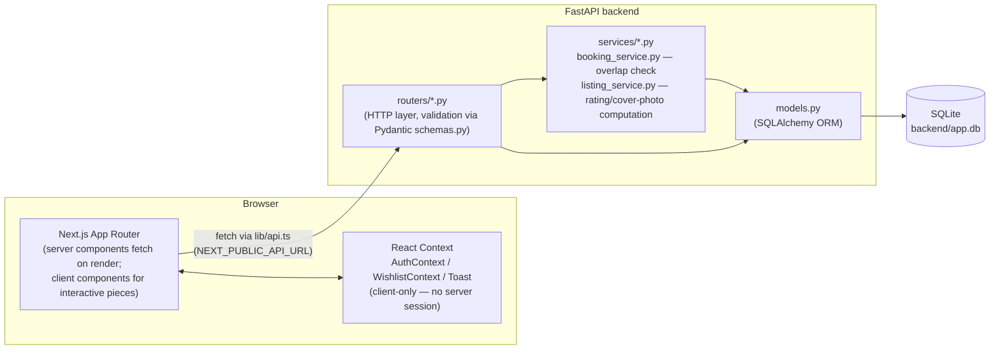
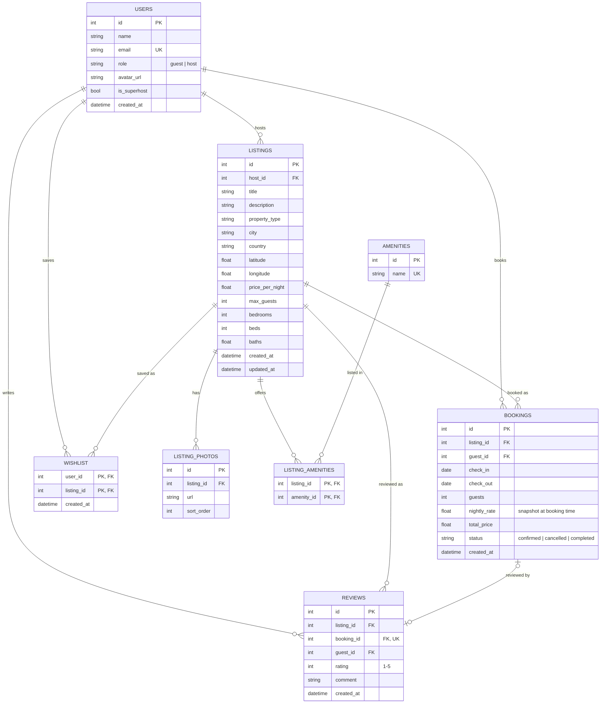

# Airbnb Clone

A functional clone of Airbnb: browse/search listings, view listing detail,
book a date range, and manage listings as a host. Visual and UX fidelity to
Airbnb matters as much as functionality. All external services — payments,
maps, image hosting — are mocked.

[CLAUDE.md](Claude.md) is the day-to-day source of truth for conventions,
schema, and API design used while building this; this README is the
outward-facing summary for setup, architecture, and deployment.

## Tech Stack

| Layer | Choice |
|---|---|
| Frontend | Next.js 16 (App Router), TypeScript, Tailwind CSS |
| Backend | FastAPI (Python 3.11+), SQLAlchemy ORM, Alembic migrations |
| Database | SQLite (file-based, `backend/app.db`) |
| Auth | Mocked — a `role` (`guest`\|`host`) field on the user, a client-side "current user" selector (`AuthContext`), no real sessions or passwords |
| Dates | `date-fns` on the frontend; `DATE`/`DATETIME` columns and ISO `YYYY-MM-DD` strings over the wire |

Scaffolded originally against the Next.js 14 baseline named in the project
brief, then upgraded to 16 during setup — 14.2.33 had five high-severity
security advisories with no 14.x patch available, and nothing had been built
yet, so it was the cheapest possible time to absorb the breaking changes
(async `params`/`searchParams`, Turbopack by default, React 19).

## Architecture Overview



**Backend** is layered: `routers/` handle HTTP concerns and validation only;
shared business logic that multiple endpoints need (booking overlap
checking, the rating/review-count/cover-photo computation used by search,
trips, and wishlist) lives once in `services/`, not copy-pasted per route.
Pydantic schemas (`schemas.py`) are the only thing routers return — no
SQLAlchemy object ever crosses the API boundary directly.

**Frontend** follows the App Router split: pages that only need to *read*
data are server components fetching directly in the route (e.g. the home
page, listing detail). Pages that need per-user state unavailable on the
server — because "logged in as" lives in `localStorage`, not a real session
— are client components (`/trips`, `/wishlist`, `/host/dashboard`, the
booking flow). All requests funnel through `lib/api.ts`; nothing calls
`fetch` directly from a component.

**Auth** is intentionally centralized: `AuthContext` is the only place that
knows about the current user. Nothing else hardcodes a role check or reaches
into `localStorage` directly — swapping in real authentication later means
replacing `AuthContext`'s internals, not hunting through every component.

### Repo layout

```
frontend/
  app/                    # routes (page.tsx per folder = App Router)
    page.tsx                        # home/explore
    listing/[id]/page.tsx           # listing detail
    trips/page.tsx                  # guest's bookings
    wishlist/page.tsx
    host/dashboard/page.tsx         # host's listings + bookings-per-listing
    host/listings/new/page.tsx
    host/listings/[id]/edit/page.tsx
  components/             # one component per file; ListingForm.tsx is
                           # shared by the new/edit host pages
  context/                # AuthContext, WishlistContext (client-only state)
  lib/                    # api.ts (all fetches), types.ts, constants.ts, url.ts
backend/
  app/
    main.py                # FastAPI app, CORS, router registration
    database.py             # engine/session (DATABASE_URL-configurable)
    models.py                # SQLAlchemy ORM models
    schemas.py                # Pydantic request/response models
    routers/                  # listings, bookings, reviews, wishlist, users
    services/                  # booking_service, listing_service
    seed.py                     # idempotent demo-data seeder
  alembic/                # migrations
```

## Database Schema

Photos and amenities are normalized into their own tables rather than
comma-separated strings. `listings.rating` is deliberately **not** a stored
column — it's computed from `reviews` at query time (see
`app/services/listing_service.py`), shared by every endpoint that needs it
so the computation isn't duplicated. Booking overlap has no DB-level
exclusion constraint (SQLite doesn't support one) — it's enforced in
`app/services/booking_service.py`, the single place that logic lives.
`reviews.booking_id` is nullable and unique: a review may optionally tie
back to the booking it followed, but at most one review per booking.



Indexes: `listings(city)`, `listings(price_per_night)`, `listings(host_id)`,
`bookings(listing_id)`, `bookings(guest_id)`, `reviews(listing_id)` — the
columns actually used in search/filter.

## API Overview

Base path: `/api/v1`. Errors are a consistent `{"detail": "message"}` shape
with the appropriate status (404, 409 for booking conflicts, 422 for
validation). Full interactive docs at `/docs` (Swagger) once the backend is
running.

| Method | Path | Notes |
|---|---|---|
| GET | `/listings` | Search/filter/paginate — `city`, `check_in`+`check_out`, `guests`, `min_price`, `max_price`, `property_type`, `amenities`, `host_id`, `page`, `page_size` |
| POST | `/listings` | Create (host-owned) |
| GET | `/listings/{id}` | Full detail — host, photos, amenities, computed rating |
| PUT | `/listings/{id}` | Partial update — all fields optional, PATCH-like |
| DELETE | `/listings/{id}` | Delete |
| GET | `/listings/{id}/bookings` | Confirmed-only date ranges, no guest identity — the public calendar-blocking view |
| GET | `/listings/{id}/bookings/all` | Every status, with guest identity — the host-dashboard view |
| GET | `/listings/{id}/reviews` | Reviews for a listing |
| GET | `/amenities` | The fixed amenity list, for search filters and the host form |
| POST | `/bookings` | Create — 409 on date overlap with an existing confirmed booking |
| POST | `/reviews` | Create — optionally tied to a completed booking |
| POST | `/wishlist` | Add (idempotent — re-adding an existing item is a no-op) |
| DELETE | `/wishlist/{listing_id}?user_id=` | Remove |
| GET | `/users` | All users — powers the mocked "current user" selector |
| GET | `/users/{id}` | User detail |
| GET | `/users/{id}/trips` | A guest's bookings |
| GET | `/users/{id}/wishlist` | A user's saved listings |

`host_id` on `/listings`, and the `/amenities` and `/listings/{id}/bookings/all`
endpoints aren't part of the original documented spec — they were added
because the host dashboard and amenity-picker UI need them to function; see
[CLAUDE.md](Claude.md)'s API Conventions section for the full reasoning.

## Setup

**Prerequisites:** Python 3.11+ (built/verified against 3.14), Node.js
18.17+ (verified against 24 LTS).

### Backend (port 8000)

```powershell
cd backend
python -m venv .venv
.\.venv\Scripts\Activate.ps1
pip install -r requirements.txt
alembic upgrade head
python -m app.seed
uvicorn app.main:app --reload --port 8000
```

- Health check: <http://localhost:8000/api/v1/health>
- Swagger docs: <http://localhost:8000/docs>

`requirements.txt` uses floor (`>=`) pins rather than exact pins — on very
new Python versions some exact-pinned packages (`pydantic-core` in
particular) don't have prebuilt wheels yet and would otherwise fail to build
without a Rust toolchain + MSVC linker.

`python -m app.seed` is idempotent (clears and reinserts a fixed demo
dataset) — safe to re-run any time you want a clean slate: 6 users (3 host,
3 guest), 48 listings across 6 cities, bookings mixing past/upcoming, and a
few reviews per listing.

### Frontend (port 3000)

```powershell
cd frontend
npm install
npm run dev
```

- App: <http://localhost:3000>

Copy `frontend/.env.local.example` to `frontend/.env.local` if it doesn't
already exist — it points the frontend at the local backend
(`NEXT_PUBLIC_API_URL=http://localhost:8000/api/v1`).

Start the backend first — the frontend fetches from it on every page.

## Assumptions & Known Limitations

- **Auth is fully mocked.** `AuthContext` holds a client-side "current user"
  (persisted to `localStorage`), not a real session. The backend performs
  **no server-side authorization** — e.g. `PUT /listings/{id}` will let any
  caller edit any listing regardless of `host_id`. The frontend adds its own
  ownership guard (edit page checks `listing.host_id === currentUser.id`)
  purely as a UX safeguard, not a security boundary. This mirrors the
  project brief's explicit "don't add real auth" instruction.
- **Payments are mocked.** The booking confirmation modal is a real UI step
  with a real summary, but explicitly says "no real payment is processed" —
  clicking through calls `POST /bookings` directly.
- **Maps are mocked by omission.** `latitude`/`longitude` are stored and
  returned by the API (per the schema), but no map library is used anywhere
  in the UI — listings show city/country text instead.
- **Image hosting is mocked.** Listing photos are plain URLs (curated
  picsum.photos IDs in the seed data; hosts paste arbitrary URLs via the
  listing form) rather than a real upload/storage pipeline.
- **No review-submission UI.** `POST /reviews` exists and is fully
  functional on the backend, but nothing in the frontend calls it yet —
  reviews are seed-only from the UI's perspective.
- **No booking cancellation.** The `status` column supports `'cancelled'`,
  but no endpoint or UI flow sets it — bookings can only be created, never
  cancelled, through the app itself.
- **`schemas.py` and `lib/types.ts` are kept in sync by hand.** No codegen
  at this project's size; a schema change requires updating both.
- **Property types are a fixed convention, not a table.** Unlike amenities
  (a real normalized table), `property_type` is free text constrained only
  by a shared frontend/seed list (`lib/constants.ts`) — adding a new type
  means updating that list, not a migration.

## Deployment

Backend on Render, frontend on Vercel. Two environment variables are the
entire difference between local dev and production — `CORS_ALLOWED_ORIGINS`
(backend) and `NEXT_PUBLIC_API_URL` (frontend); everything else about the
app is identical in both environments.

A real limitation to know going in: **SQLite lives on the filesystem**, and
Render's web services have an *ephemeral* filesystem by default — every
redeploy or restart gets a fresh disk, so `backend/app.db` reverts to
whatever `python -m app.seed` last wrote at build time. For a demo/portfolio
deployment that's usually fine (or even desirable — always-fresh data). If
you need bookings made on the live site to actually persist, attach a
[Render Disk](https://render.com/docs/disks) and point `DATABASE_URL` at a
path on it (see "Backend on Render" step 7 below).

### 0. Prerequisite: push to a git remote

Render and Vercel both deploy from a connected GitHub (or GitLab/Bitbucket)
repo. This project isn't a git repo yet:

```powershell
cd C:\Users\adity\Desktop\Scaler_Assignment
git init
git add .
git commit -m "Initial commit"
```

Then create a GitHub repo and push (via `gh repo create` or the GitHub web
UI + `git remote add origin <url>` + `git push -u origin main`).

### 1. Backend on Render

1. **New → Web Service** → connect the GitHub repo.
2. **Root directory**: `backend`.
3. **Runtime**: Python 3.
4. **Build command**: `pip install -r requirements.txt && alembic upgrade head`
5. **Start command**: `uvicorn app.main:app --host 0.0.0.0 --port $PORT`
6. **Environment variables** (Render dashboard → Environment):
   | Key | Value |
   |---|---|
   | `CORS_ALLOWED_ORIGINS` | leave unset for now — comes back in step 3 |
   | `DATABASE_URL` | only if using a persistent disk — see below |
7. *(Optional, for persistence)* Add a **Render Disk**, mount path e.g.
   `/data`, then set `DATABASE_URL=sqlite:////data/app.db` (four slashes —
   three for the `sqlite://` scheme, one to start the absolute path).
8. Deploy. Once live, seed it once via Render's **Shell** tab:
   `python -m app.seed`. (If you'd rather always start from fresh demo data
   — reasonable given the ephemeral-disk default — append
   `&& python -m app.seed` to the start command instead, so it reseeds on
   every deploy.)
9. Note the assigned URL, e.g. `https://airbnb-clone-api.onrender.com`.
10. Verify: `https://<render-url>/api/v1/health` → `{"status":"ok"}`, and
    `https://<render-url>/docs` loads Swagger.

### 2. Frontend on Vercel

1. **Add New → Project** → import the same GitHub repo.
2. **Root directory**: `frontend`. Framework preset (Next.js) is
   auto-detected.
3. **Environment variable**: `NEXT_PUBLIC_API_URL` =
   `https://<render-url>/api/v1` (the URL from step 1.9, with the API
   prefix).
4. Deploy. Note the assigned URL, e.g. `https://airbnb-clone.vercel.app`.

`NEXT_PUBLIC_*` variables are inlined into the JavaScript bundle at **build
time**, not read at runtime — if you change `NEXT_PUBLIC_API_URL` later,
trigger a new deploy (not just a restart) for it to take effect.

### 3. Close the loop: update backend CORS

Now that the Vercel URL exists, go back to Render:

1. Environment → set `CORS_ALLOWED_ORIGINS` to the Vercel URL from step
   2.4 (comma-separate multiple origins if needed, e.g. a custom domain
   alongside the `*.vercel.app` one — exact match only, no wildcards).
2. Save — Render redeploys automatically on env var changes.

### 4. Post-deploy verification

- [ ] `GET https://<render-url>/api/v1/health` → `{"status":"ok"}`
- [ ] `https://<render-url>/docs` loads
- [ ] `python -m app.seed` has been run at least once (listings aren't empty)
- [ ] The Vercel URL's home page shows listing rows, not an error state
- [ ] Browser devtools console/network tab: no CORS errors on the deployed
      frontend
- [ ] End-to-end: search, open a listing, complete a mocked booking, see it
      appear under Trips
- [ ] Image domains: no change needed — `picsum.photos` and `i.pravatar.cc`
      are already in `next.config.mjs`'s `images.remotePatterns`, baked into
      the frontend build regardless of environment

### Notes specific to Render's free tier

Free web services spin down after inactivity; the first request after idle
can take 30–60s to cold-start. Not a bug — just don't be surprised by a slow
first load when showing this to someone after it's been idle.
